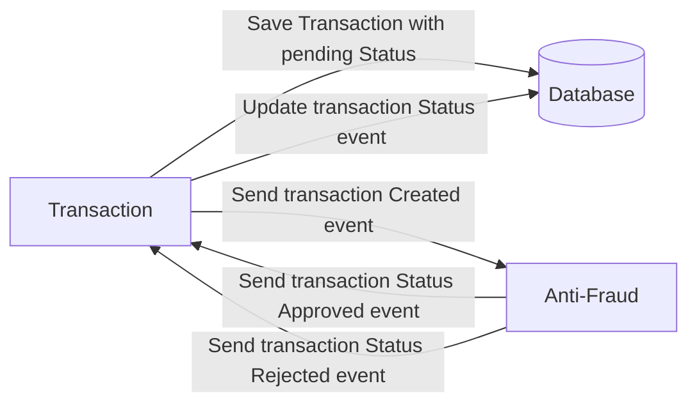

# Yape Code Challenge 🚀

**_By: Diego Gutierrez P._**

## Problem

Every time a financial transaction is created it must be validated by our anti-fraud microservice and then the same service sends a message back to update the transaction status.
For now, we have only three transaction statuses:

<ol>
  <li>pending</li>
  <li>approved</li>
  <li>rejected</li>  
</ol>

Every transaction with a value greater than 1000 should be rejected.

## Implementation

### Tech Stack

<ol>
  <li>NestJS</li>
  <li>Postgres</li>
  <li>Kafka</li>    
</ol>

### Architecture & patterns

<ol>
  <li>Clean architecture</li>
  <li>Layer architecture</li>
  <li>CQRS</li>    
  <li>Monorepo</li>    
</ol>

### Start up the project

1. Clone the repository
2. Copy .env.example and rename to .env
3. Start the services: `docker compose up --build`
